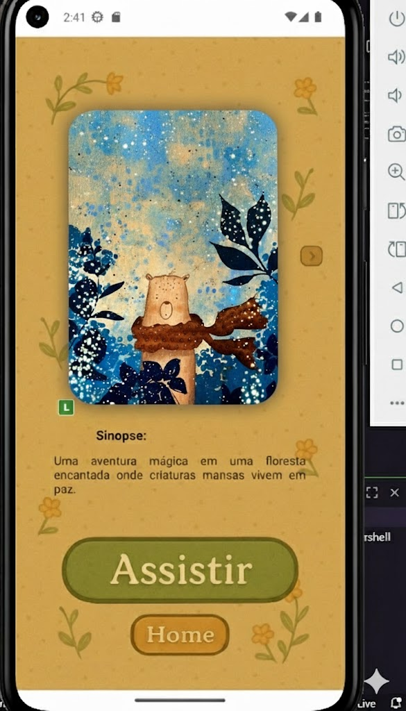

🌈✨ Mundo Manso
Um aplicativo infantil pensado no bem‑estar das crianças
Entretenimento saudável, sem vícios, com conteúdo clássico e tranquilo

License: MIT

👉 Agradecimento especial: ao designer Lucas Hiago, responsável pelas telas do app. Em parceria, conseguimos entregar o projeto com nota máxima, atendendo às exigências dos professores e à ementa do curso de ADS da UNINASSAU. Obrigado, Lucas! 👏

📸 Screenshots

   
 
   

📖 Sobre o Projeto
Mundo Manso é um aplicativo mobile desenvolvido especialmente para crianças, focado em proporcionar uma experiência digital saudável e tranquila. Em um mundo onde apps infantis costumam maximizar tempo de tela, o Mundo Manso vai na contramão. 🌿

🎯 Nossa Filosofia
🧠 Sem vícios digitais: conteúdo para entreter sem criar dependência
👀 Proteção visual: paleta de cores suaves que não cansam a visão
📼 Conteúdo clássico: desenhos atemporais com valores positivos
🛟 Tranquilidade garantida: ambiente seguro para as crianças
🧩 Design calmo: interface infantil, clara e não hiperstimulante
🌟 Conceito
👧 Crianças se entretêm de forma saudável
👨‍👩‍👧 Pais têm paz de espírito durante o tempo de tela
📚 O conteúdo contribui para o desenvolvimento, não só para atenção
✨ Funcionalidades Atuais
📺 Biblioteca de desenhos clássicos e educativos
🎨 Interface com cores suaves
👶 Navegação intuitiva para crianças
🔒 Ambiente seguro e controlado
🚫 Sem elementos viciantes ou alertas constantes
🚀 Roadmap — Próximas Funcionalidades
Fase 2 — 🛒 E‑commerce Integrado
📚 Livros de atividades
🧸 Brinquedos temáticos
🎨 Material escolar
👕 Vestuário infantil
🛁 Cosméticos infantis
🎁 Kits personalizados
Fase 3 — 🧩 Recursos Adicionais
🧑‍🚀 Controle parental avançado
👧 Perfis por criança
✈️ Modo offline
🧠 Conteúdo educativo interativo
🛠️ Tecnologias Utilizadas
text

- React Native
- Expo
- TypeScript
- Styled Components
- Context API / Redux
- React Navigation
📋 Pré‑requisitos
✅ Node.js (v16+)
✅ Git
✅ Expo CLI
✅ Emulador Android/iOS ou app Expo Go
Ambiente de desenvolvimento

🔙 Back-end: Spring Boot na porta 8081
📱 Emulador Android acessa a API do PC por http://10.0.2.2:8081
🔁 Metro/Expo em porta diferente (ex.: 8082)
🔧 Instalação
Clone o repositório
Bash

git clone https://github.com/JaoVile/MundoManso.git
cd MundoManso
Instale as dependências
Bash

npm install
# ou
yarn install
Inicie o projeto (evitando conflito com 8081)
Bash

npx expo start --port 8082
# atalhos: 'a' para Android, 'i' para iOS (macOS)
Dispositivo físico
Instale o app Expo Go
Escaneie o QR Code do terminal
📱 Como Usar
Abra o aplicativo
Navegue pela biblioteca de conteúdos
Selecione um desenho/atividade
Aproveite um momento tranquilo com seu filho! 🌈
🎨 Paleta de Cores
Nossa paleta foi cuidadosamente selecionada pensando na saúde visual infantil:

CSS

Cores Principais:
- Verde Suave: #A8D5BA
- Azul Céu: #B8D4E8
- Amarelo Pastel: #F9E5A8
- Rosa Claro: #F5CAC3
- Lavanda: #D4C5E8
🤝 Como Contribuir
Faça um Fork do projeto
Crie uma branch: git checkout -b feature/AmazingFeature
Commit: git commit -m 'Add some AmazingFeature'
Push: git push origin feature/AmazingFeature
Abra um Pull Request
👥 Autores
🎨 Lucas Hiago — UI/UX Design
💻 João Marcos (João Vile) — Desenvolvimento
GitHub: @JaoVile
📄 Licença
Este projeto está sob a licença MIT. Veja o arquivo LICENSE para mais detalhes.

🙏 Agradecimentos
👏 Designer: Lucas Hiago — pelas telas e parceria que nos permitiu concluir o projeto com nota máxima, atendendo às exigências dos professores e da ementa do curso de ADS da UNINASSAU.
👪 A todos os pais que se preocupam com o consumo digital saudável das crianças
🌐 Comunidade open source
💚 A todas as pessoas que contribuírem com este projeto
⚠️ Aviso legal sobre imagens
As imagens deste repositório e do README são próprias, de domínio público (CC0) ou possuem licença compatível para redistribuição.
Este projeto não é afiliado, endossado ou patrocinado por quaisquer detentores de marcas ou personagens.
Encontrou algo com licença incompatível? Abra uma issue que substituímos imediatamente.
💚 Feito com amor e responsabilidade para as crianças
“Tecnologia pode ser gentil com a infância”

📞 Suporte
Em caso de dúvidas ou sugestões, abra uma issue.